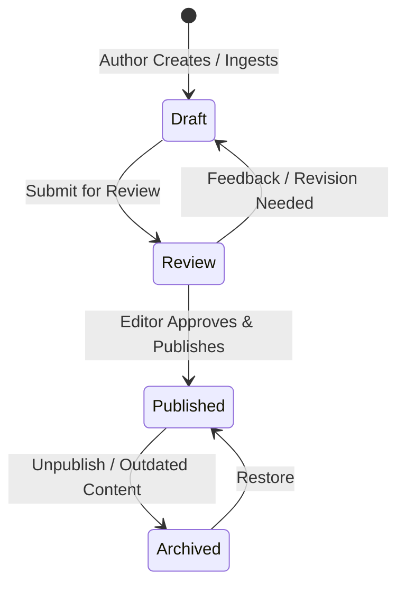

# Article Workflow & Editorial Pipeline — my-news-app

This document outlines the step-by-step lifecycle of an article from content creation/ingestion to final publishing and archiving in **my-news-app**.

---

## 🔄 Article Lifecycle Flow

---

## 📝 Step-by-Step Execution Plan

### Step 1: Content Ingestion / AI Draft Generation
- Input: Raw RSS feed, news API item, or manual author text.
- Action:
  1. Extract title, body, original source URL, and published date.
  2. Call LLM AI assistant to generate:
     - Short summary (3 bullet points)
     - Relevant tags and category assignment
     - SEO Meta Title and Description
  3. Save article in `articles` table with `status = 'draft'`.

### Step 2: Editorial Review
- Action:
  1. Editors review the drafted article in the admin portal.
  2. Verify source attribution, image copyright, and formatting.
  3. Transition status from `draft` to `review` or back to `draft` with feedback.

### Step 3: Publishing & Notification
- Action:
  1. Editor approves article and sets `status = 'published'` and `published_at = NOW()`.
  2. Trigger Realtime event to push live breaking news notifications to active readers.
  3. Regenerate static category index pages (if ISR enabled).

### Step 4: Engagement & Archival
- Track article analytics (`view_count`, bookmarks, comments).
- Automatically flag outdated breaking news for archive after 30 days if configured.
