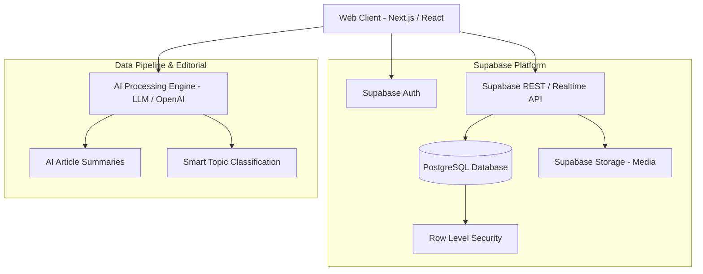

# Architecture & System Design — my-news-app

This document describes the high-level architecture, component hierarchy, data flow, and database schema for **my-news-app**.

---

## 🏗️ System Overview

---

## 🗄️ Database Architecture

The core relational database is powered by Supabase PostgreSQL.

### Key Entities
1. **`profiles`**: Extends `auth.users`. Stores user roles (`reader`, `author`, `editor`, `admin`), bio, avatar URL, and topic preferences.
2. **`categories`**: News categories (Tech, Business, Politics, etc.) with slugs and descriptions.
3. **`articles`**: News posts containing titles, slugs, Markdown content, AI summaries, featured images, status (`draft`, `review`, `published`, `archived`), and view counts.
4. **`tags` & `article_tags`**: Many-to-many relationship for granular tagging.
5. **`bookmarks`**: User saved articles.
6. **`comments`**: Threaded comments per article with moderation flags.
7. **`ai_generation_logs`**: Log of AI prompts, token usage, and generated outputs for editorial auditing.

---

## 🔐 Security & Access Control (RLS)

- **Public Readers:** Can read `published` articles, public `categories`, `tags`, and approved `comments`.
- **Authenticated Readers:** Can manage their own `profiles`, create/delete their own `bookmarks`, and submit `comments`.
- **Authors:** Can create, edit, and view their own draft articles.
- **Editors & Admins:** Full write/publish/delete access to all articles, categories, comments, and AI logs.

---

## 🚀 Performance & Caching Strategy

- **Static Generation / ISR:** Frequently accessed categories and top news rendered statically with incremental regeneration.
- **Image Optimization:** Banner images served via CDN with responsive sizing (`webp`/`avif`).
- **Full-Text Search:** PostgreSQL `tsvector` index on article titles and body text for fast client-side query execution.
